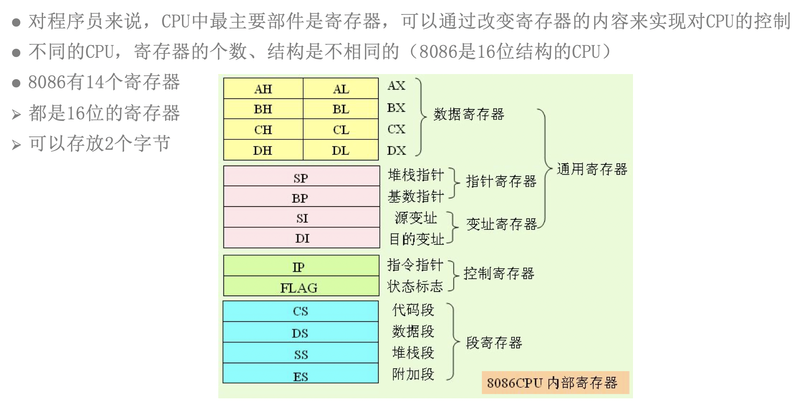
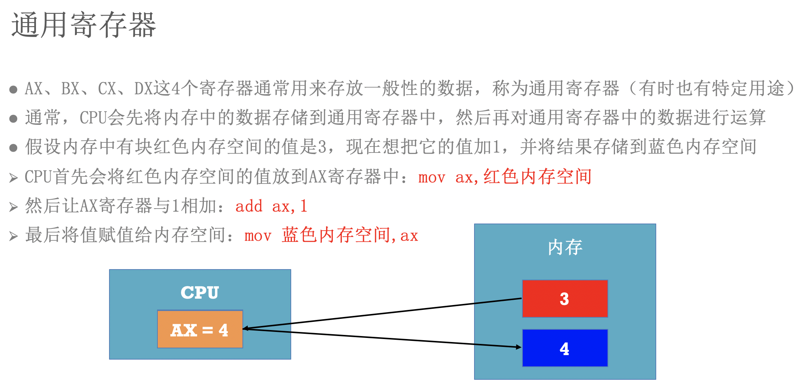
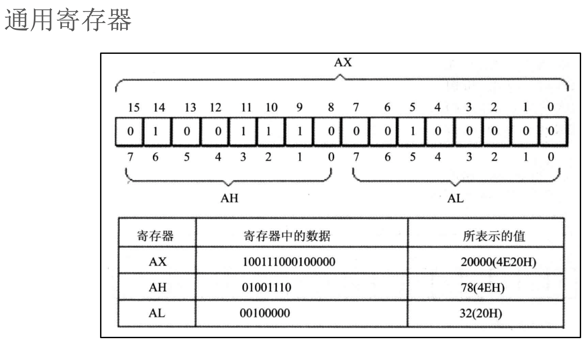
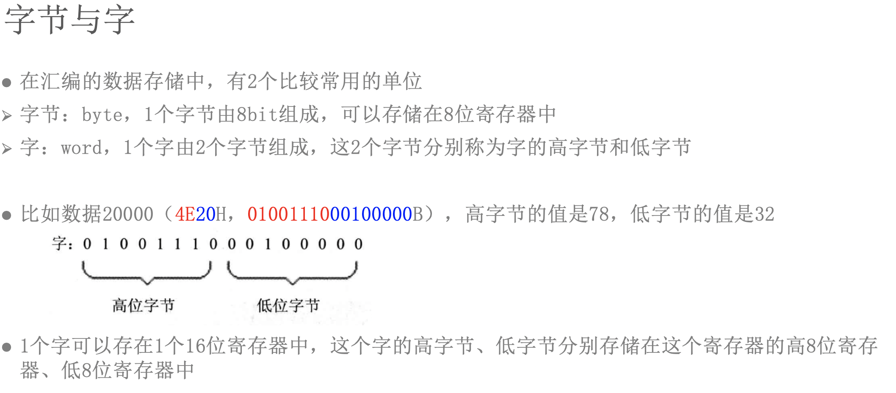
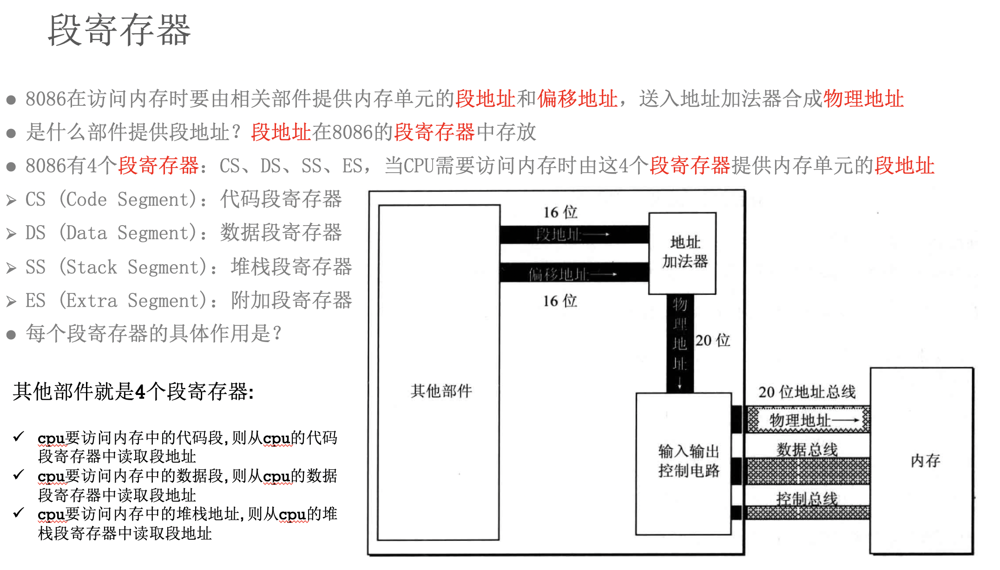

# 汇编-04-寄存器

## 简介
8086为16位寄存器, 所以可以放2个字节(1字节=8位)

CS: Code Segment 代码段
DS: Data Segment 数据段
SS: Stack Segment 堆栈段

## 8086CPU各寄存器的用途

[转自](https://www.cnblogs.com/answercard/p/4288467.html)

> 8086 有14个16位寄存器，这14个寄存器按其用途可分为(1)通用寄存器、(2)指令指针、(3)标志寄存器和(4)段寄存器等4类。

1.通用寄存器有8个, 又可以分成2组,一组是数据寄存器(4个),另一组是指针寄存器及变址寄存器(4个).

数据寄存器分为:

- AH&AL＝AX(accumulator)：累加寄存器，常用于运算;在乘除等指令中指定用来存放操作数,另外,所有的I/O指令都使用这一寄存器与外界设备传送数据.
- BH&BL＝BX(base)：基址寄存器，常用于地址索引；
- CH&CL＝CX(count)：计数寄存器，常用于计数；常用于保存计算值,如在移位指令,循环(loop)和串处理指令中用作隐含的计数器.
- DH&DL＝DX(data)：数据寄存器，常用于数据传递。

> 他们的特点是,这4个16位的寄存器可以分为高8位: AH, BH, CH, DH.以及低八位：AL,BL,CL,DL。这2组8位寄存器可以分别寻址，并单独使用。

另一组是指针寄存器和变址寄存器，包括：

- SP（Stack Pointer）：堆栈指针，与SS配合使用，可指向目前的堆栈位置；
- BP（Base Pointer）：基址指针寄存器，可用作SS的一个相对基址位置；
- SI（Source Index）：源变址寄存器可用来存放相对于DS段之源变址指针；
- DI（Destination Index）：目的变址寄存器，可用来存放相对于 ES 段之目的变址指针。

> 这4个16位寄存器只能按16位进行存取操作，主要用来形成操作数的地址，用于堆栈操作和变址运算中计算操作数的有效地址。

2.指令指针IP(Instruction Pointer)
指令指针IP是一个16位专用寄存器，它指向当前需要取出的指令字节，当BIU从内存中取出一个指令字节后，IP就自动加1，指向下一个指令字节。注意，IP指向的是指令地址的段内地址偏移量，又称偏移地址(Offset Address)或有效地址(EA，Effective Address)。

3.标志寄存器FR(Flag Register)

> 8086有一个18位的标志寄存器FR，在FR中有意义的有9位，其中6位是状态位，3位是控制位。

OF： 溢出标志位OF用于反映有符号数加减运算所得结果是否溢出。如果运算结果超过当前运算位数所能表示的范围，则称为溢出，OF的值被置为1，否则，OF的值被清为0。

DF：方向标志DF位用来决定在串操作指令执行时有关指针寄存器发生调整的方向。 

IF：中断允许标志IF位用来决定CPU是否响应CPU外部的可屏蔽中断发出的中断请求。但不管该标志为何值，CPU都必须响应CPU外部的不可屏蔽中断所发出的中断请求，以及CPU内部产生的中断请求。具体规定如下： 
(1)、当IF=1时，CPU可以响应CPU外部的可屏蔽中断发出的中断请求； 
(2)、当IF=0时，CPU不响应CPU外部的可屏蔽中断发出的中断请求。 

TF：跟踪标志TF。该标志可用于程序调试。TF标志没有专门的指令来设置或清楚。
（1）如果TF=1，则CPU处于单步执行指令的工作方式，此时每执行完一条指令，就显示CPU内各个寄存器的当前值及CPU将要执行的下一条指令。
（2）如果TF=0，则处于连续工作模式。

SF：符号标志SF用来反映运算结果的符号位，它与运算结果的最高位相同。在微机系统中，有符号数采用补码表示法，所以，SF也就反映运算结果的正负号。运算结果为正数时，SF的值为0，否则其值为1。 

ZF： 零标志ZF用来反映运算结果是否为0。如果运算结果为0，则其值为1，否则其值为0。在判断运算结果是否为0时，可使用此标志位。 

AF：下列情况下，辅助进位标志AF的值被置为1，否则其值为0： 
(1)、在字操作时，发生低字节向高字节进位或借位时； 
(2)、在字节操作时，发生低4位向高4位进位或借位时。 
PF：奇偶标志PF用于反映运算结果中“1”的个数的奇偶性。如果“1”的个数为偶数，则PF的值为1，否则其值为0。 

CF：进位标志CF主要用来反映运算是否产生进位或借位。如果运算结果的最高位产生了一个进位或借位，那么，其值为1，否则其值为0。) 

4.段寄存器(Segment Register)
为了运用所有的内存空间，8086设定了四个段寄存器，专门用来保存段地址：

CS（Code Segment）：代码段寄存器；
DS（Data Segment）：数据段寄存器；
SS（Stack Segment）：堆栈段寄存器；
ES（Extra Segment）：附加段寄存器。

当一个程序要执行时，就要决定程序代码、数据和堆栈各要用到内存的哪些位置，通过设定段寄存器 CS，DS，SS 来指向这些起始位置。通常是将DS固定，而根据需要修改CS。所以，程序可以在可寻址空间小于64K的情况下被写成任意大小。 所以，程序和其数据组合起来的大小，限制在DS 所指的64K内，这就是COM文件不得大于64K的原因。8086以内存做为战场，用寄存器做为军事基地，以加速工作

