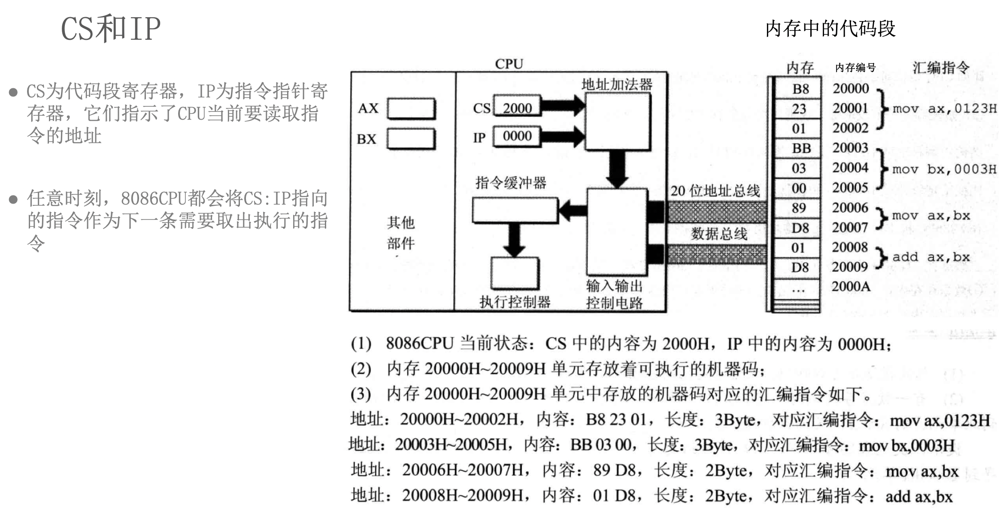
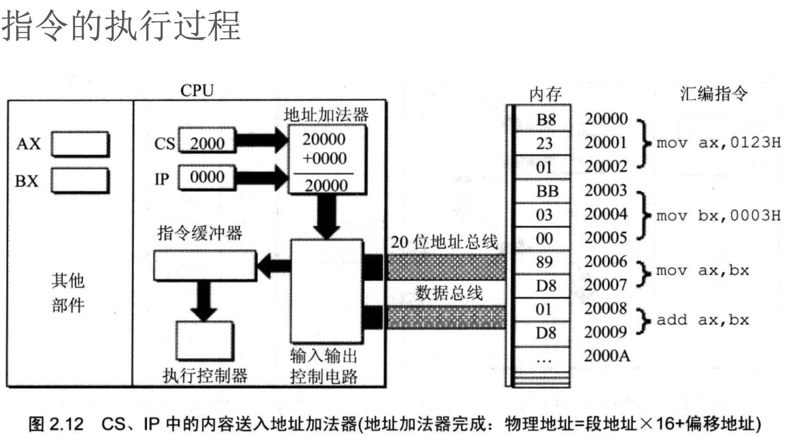
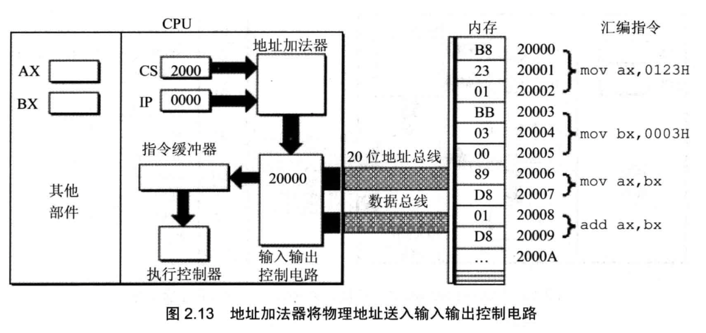
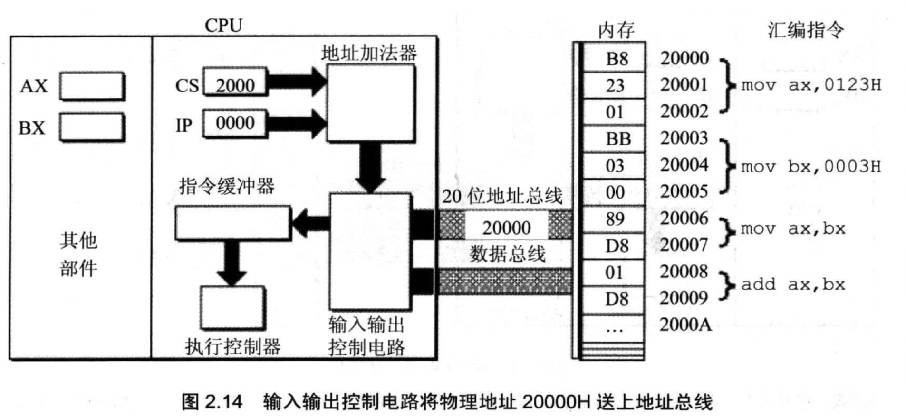
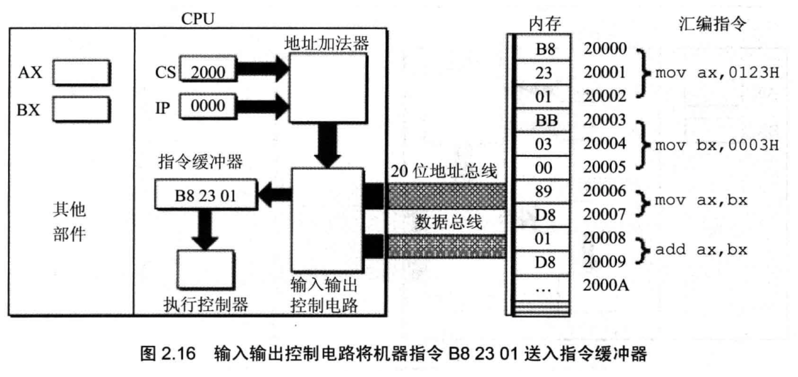
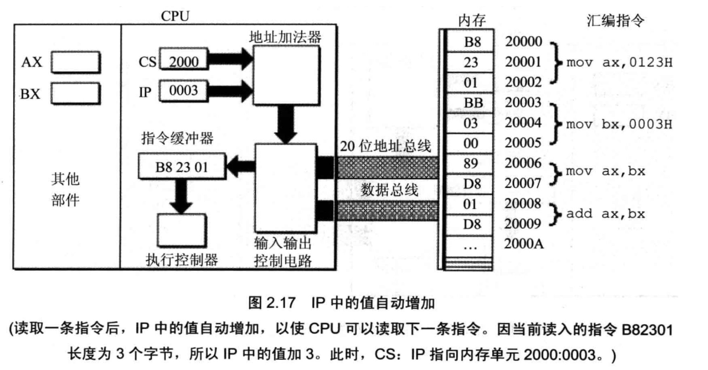
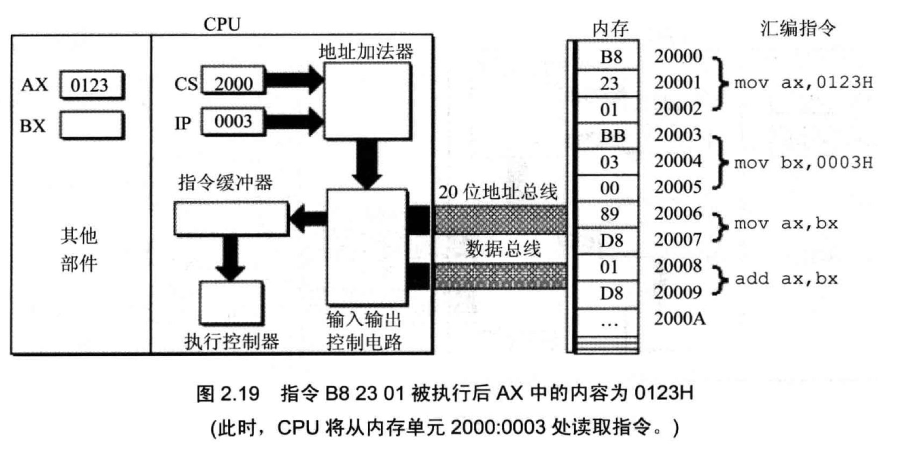
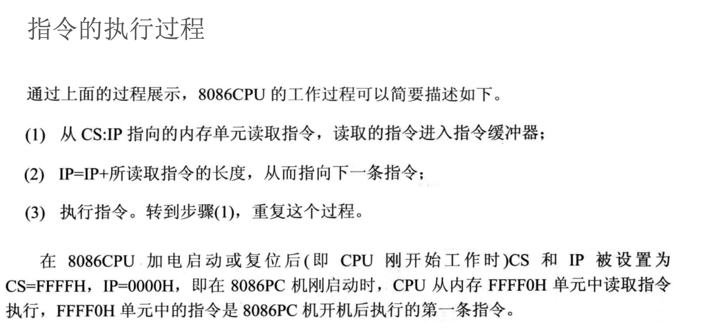

# 汇编-05-CS/IP寄存器,内存中指令和数据

## 预备

先复习`内存和内存分段`

## CS:IP
机器码和汇编指令是一一对应的, 不同的机器指令长度是不一样的,即0,1的个数不一样, 所占的内存大小也不一样, 如下图: 

CS:IP  -> 段地址和偏移地址

如果CPU想要执行`mov ax, 0123H`这个指令, 则CPU需要访问内存中的20000,20001,20002这三个字节的内存, 如上图左边的CPU, 需要CPU提供`段地址`和`偏移地址`
因为访问内存中的代码段, 则代码段寄存器(cs)提供代码段地址, IP提供偏移地址(IP: 指令指针控制寄存器)

不是访问内存中的地址, 就有IP来提供偏移地址, IP只为CS服务 (没有DS:IP, SS:IP之类的)
访问内存中的堆栈, 由堆栈段寄存器(SS)来提供堆栈段地址, 但是偏移地址并不是有IP来提供

## 指令的执行过程
指令的执行过程如下: 

CPU给内存输入的是20000这个内存地址, 内存为什么知道要从这个地址开始, 读取3个字节呢?
这个和20000编号内存中存储的B8有关, 这个B8存储着特殊的东西, 所以知道要读取3个字节这个指令才算完整

- 这块内存由CS:IP访问, 那么该内存可以当做代码段来访问, 而代码段中的`B8`, `BB`有特殊的意义, 它们知道要读取多大的内存
- 如果这块地址由数据段访问, 那么该内存可以当做数据段来访问, 那么代码中的`B8`, `BB`就没有特殊含义, 只是普通的数字

下图的执行控制器: 比如可以操纵音响, 操纵显示器, 操纵寄存器等等 

执行完这条指令(`mov ax, 0123H`)之后, 接下来执行下一条指令(`mov bx, 0003H`), 一直向下执行, 除非遇到跳转指令(C语言的goto或者汇编的jump)
`CS:IP`控制CPU执行哪一条指令, CPU不论在任何时间节点, 它都会根据CS:IP来执行哪一条命令
所以下面的IP寄存器会+3
CPU会根据CS:IP生成的地址值, 来执行这个地址对应的汇编指令, 接下来会让IP的值加上刚才执行的指令的长度, 指向下一条指令.
所以当内存将指令送给CPU之后, CPU的IP+3, 这时候这条指令还未执行

CPU是一直工作的, 不会停的, CS:IP的值是不会空的
下面这条指令执行结束后, 会继续进行地址加法器, 读取下一个内存对应的指令 

## 指令和数据
内存中存放的内容, 比如上面的`B8 23 01`,就是0和1, 对内存来说就是0和1, 但是对于我们来说, 我们可以认为它们是代码, 也可以认为它们是数字或数据

如果我们用CS:IP来访问内存,那么它们就是代码
如果我们用数据段寄存器来访问内存中的数据, 那么它们就是整数
内存中的数据如何来看待, 由我们使用哪个寄存器来访问它有关
 

