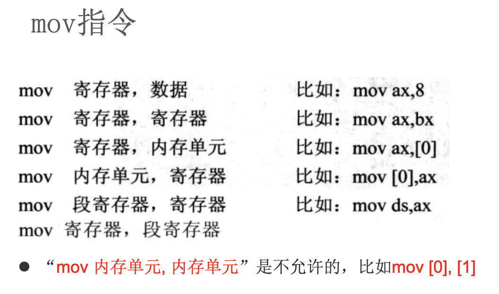
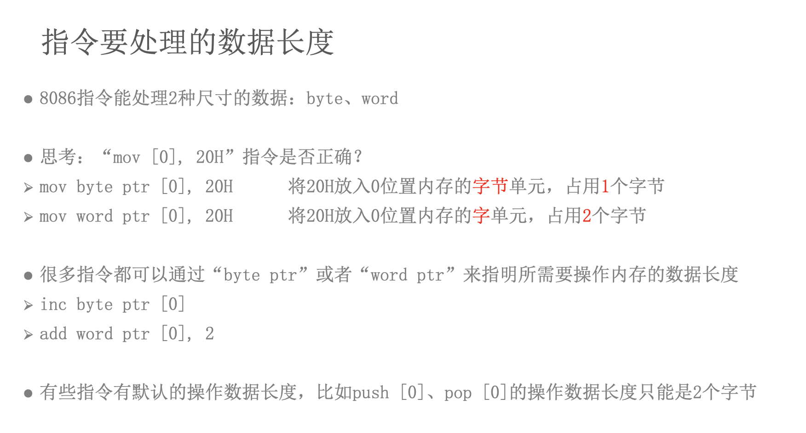

# 汇编-07-ds寄存器,数据长度

访问内存中的数据: 

- 内存在汇编中的表示 -> 段地址:[偏移地址]       
- 段地址由段寄存器来提供 数据段->ds, 代码段->cs
- `;` 表示汇编的注释

> 在8086汇编语言中,哪些段寄存器可以用MOV指令赋值,哪些段寄存器不允许?

```
- CS不可以直接赋值，这个段寄存器的值要由系统设置。其他的DS、ES、SS都可以用MOV赋值，但不能用立即数。

- CS代码段不允许赋值，其他DS，ES，SS可以用通用寄存器给赋值。

- 除了PSW，好像是都可以的
AX,BX,CX,DX,SI,DI,SP,BP,IP,CS,SS,DS,ES,都是可以用mov来赋值的
虽然有的是不能直接mov ds，123
但是可以mov ax,123 然后，mov ds,ax
=========================
IP可以用jmp来改变，cs可以用push和pop。其他的都可以使用mov，有的不能用立即数
```

举例子: 下面给段地址为1000h, 偏移地址为0h的内存地址赋值

```
;❌错误写法1 -> 段地址由段寄存器来提供 数据段->ds, 代码段->cs
mov ax, 1122h
mov 1000h:[0h], ax

;❌错误写法2 -> ds寄存器不能使用立即数赋值
mov ax, 1122h
mov ds, 1000h
mov ds:[0h], ax

;✅正确写法1 -> mov ds, bx
mov ax, 1122h
mov bx, 1000h
mov ds, bx
mov ds:[0h], ax

;✅正确写法2 -> mov [0h], ax
;8086汇编中如果不写段地址, 段地址默认为数据段
mov ax, 1122h 
mov bx, 1000h
mov ds, bx
mov [0h], ax    ;段地址为1000h
```





答案1,2: 

```
mov ax, 6622h
jmp 0ff0:0100 ;10000h -> ff00+0100=10000h
mov ax, 2000h
mov ds, ax    ;ds = 2000h
mov ax, [8]   ; ax = C389h
mov ax, [2]   ; ax = EA66h
```



