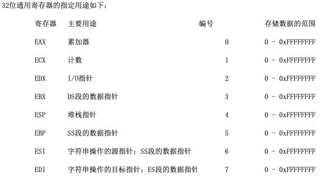
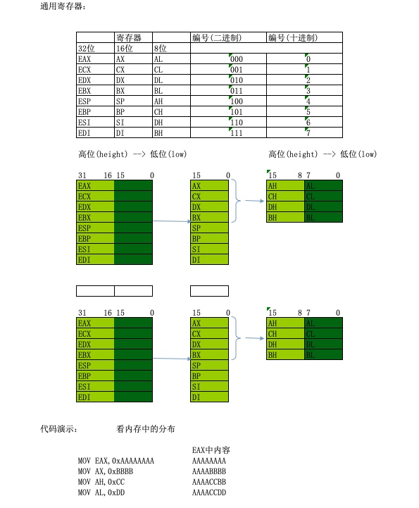
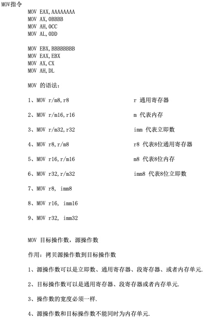
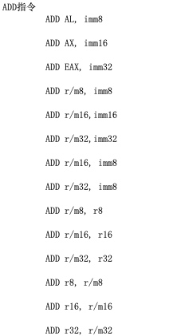
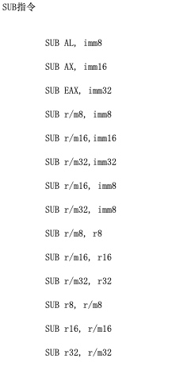
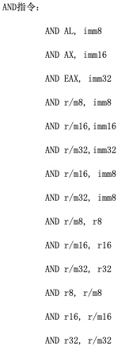
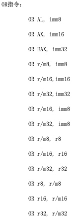
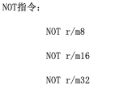

# 逆向_02_通用寄存器/常用指令

## 通用寄存器

32位寄存器 (可以存32个0或1)

寄存器是随着硬件的发展, 一步步走过来的, 所以为了兼容性设计为如下样式: 

## 常用指令

- MOV移动指令
- ADD加法指令
- SUB减法指令
- AND指令: 位运算 &  `2&3 表示 0010 & 0011 = 0010 = 2)`
- OR指令:  位运算 | 
- XOR指令: 位运算 ^ 异或
- NOT指令: 位运算 ! 非 `eax值为00000003, 则NOT EAX, EAX的值为FFFFFFFC`

举例: 

- `MOV CH,AL` 表示`mov r8, r8`(r8表示8位通用寄存器)
- `MOV CX,0xDD` 表示`mov r8, imm8`(imm8表示8立即数, 即0xDD)
- `mov eax,dword ptr ds:[0x0012FF34]` 表示:`mov r32 m32`(r32:32位寄存器, m32:32位的内存)

