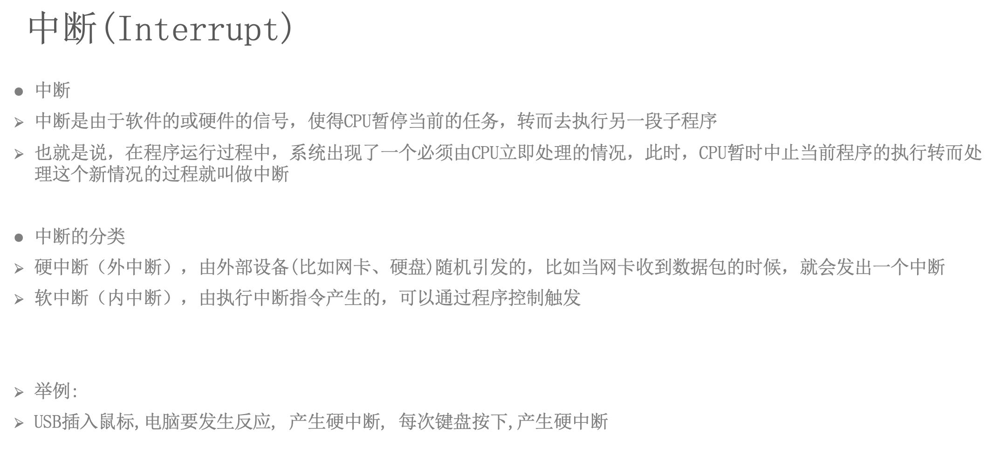
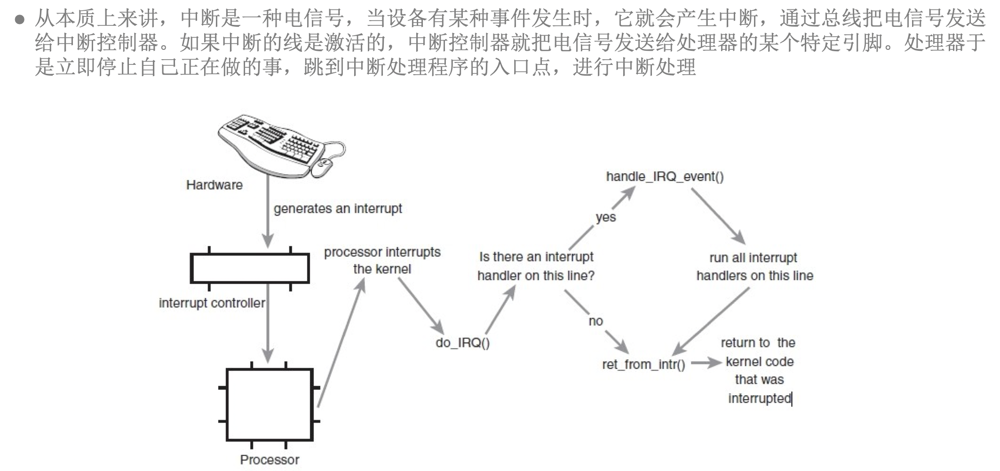
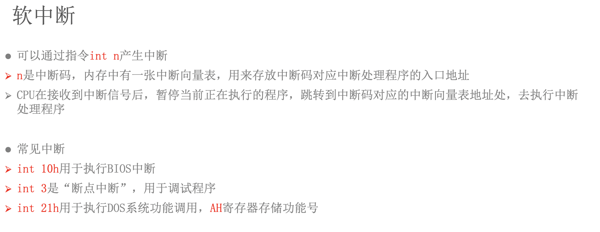
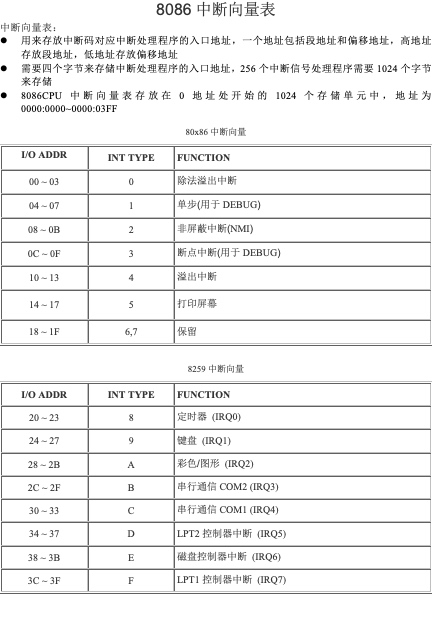
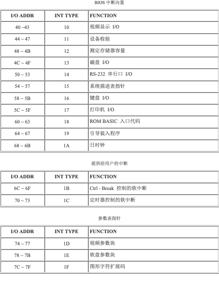
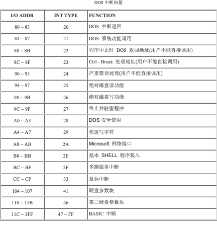
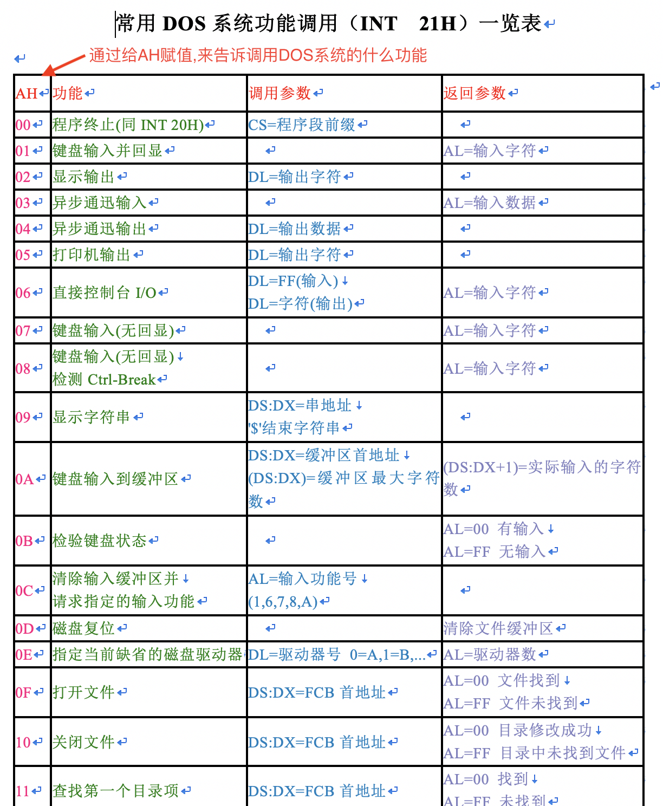
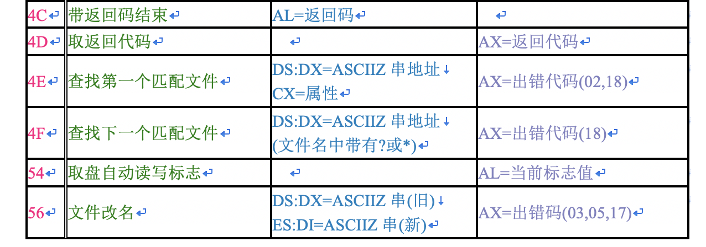
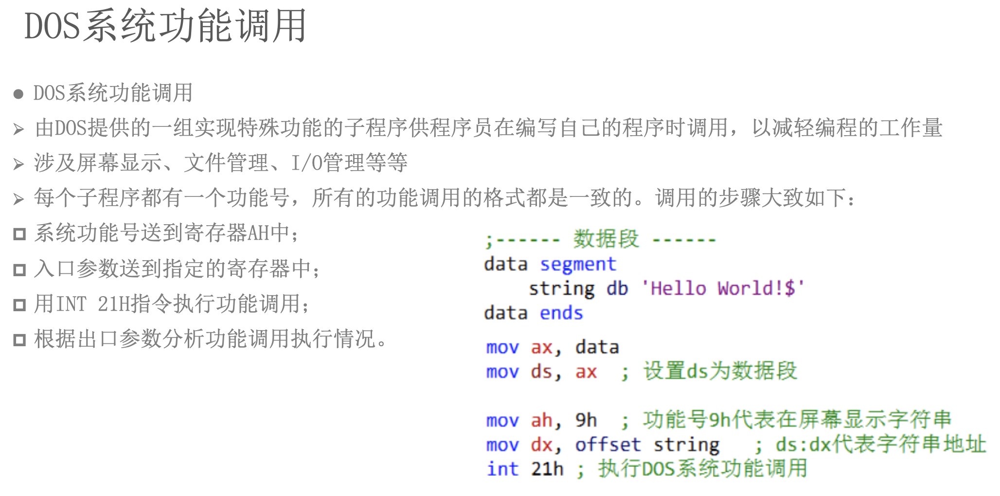

# 汇编-10-中断(Interrupt)



如上图: 按下键盘按键, 产生中断(interrupt)电信号传递给中断处理器, 中断处理器告诉CPU(Processor), CPU终止掉当前的核心任务, 然后调用`do_IRQ()`函数看能否处理这个中断事件, 能->处理中断->回到刚才的核心任务, 不能->回到刚才的核心任务






 ....
 

//TODO: 附上中断向量表和DOS功能系统调用

```
assume cs:code

code segment
    mov ax, 1122h
    mov bx, 3344h
    add ax, bx
    
    ;下面两句为正常退出程序, int表示中断
    mov ax, 4c00h ;通过AH来告诉要调用DOS系统什么功能
                  ;AH=4C表示带返回码结束
                  ;AL=00表示返回码为00
                  
    int 21h       ;中断,执行21调用DOS系统功能
code ends

end
```


