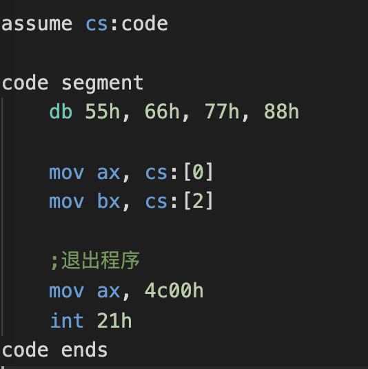
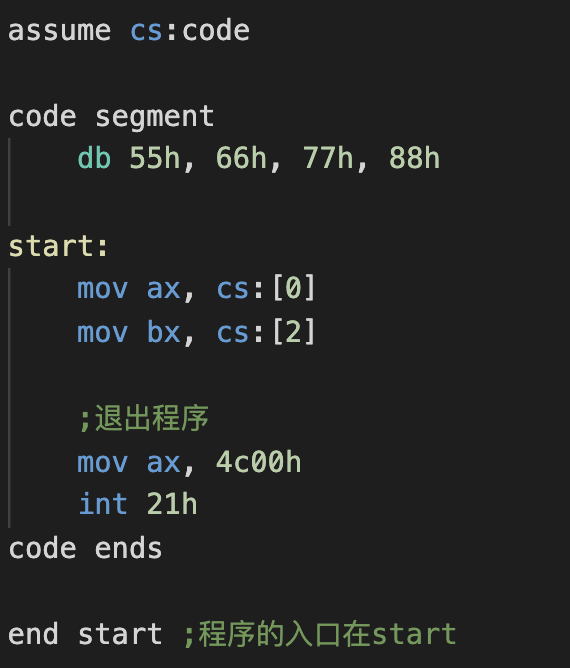
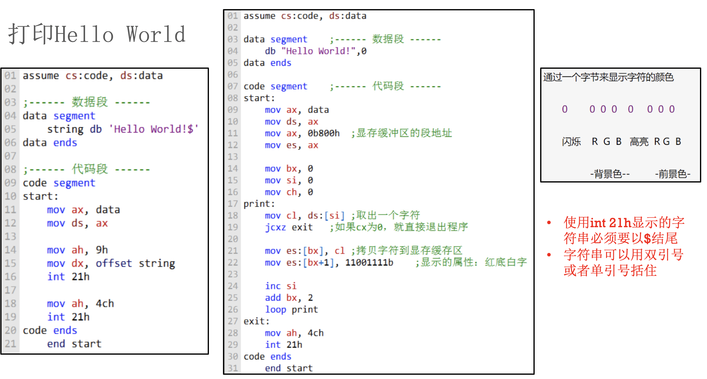

# 汇编-11-打印HelloWord


在代码段中存放数据:
下面定义了4个字节型数据: (55h, 66h, 77h, 88h)
在cs代码段中, 它们的偏移分别为: (0, 1, 2, 3)个字节, 地址越来越高
ax: 寄存器可以存放2个字节

想要将6655h放入到ax中, 8877h放入到bx中 (小端模式)

错误写法❌: 
因为在代码段: `db 55h, 66h, 77h, 88h`被编译器识别成了代码指令, 定义的数据被当做代码去执行了
正确的写法是在下面加一个标志(随便写)和对应的end标志来将代码段包围起来
 


正确写法✅: 


> 如果想定义多个数据: 

```ruby
db 10 dup(0) 

;dup->duplicate->重复
;定义了10个0, 等价于下面

db 00 00 00 00 00 00 00 00 00 00
```   
> 起别名: 

```
age db 20h
mov ch, age  ;= mov ch, 20h
```


上面的`start:`是个伪指令,表示一个标记,给编译器看的,可以随意起名字, `end + 程序入口的标记`




