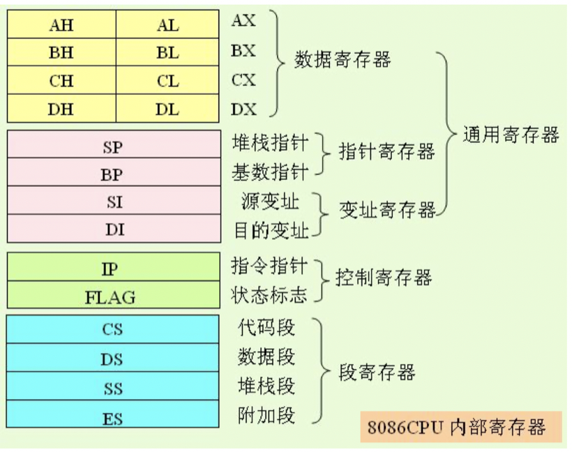
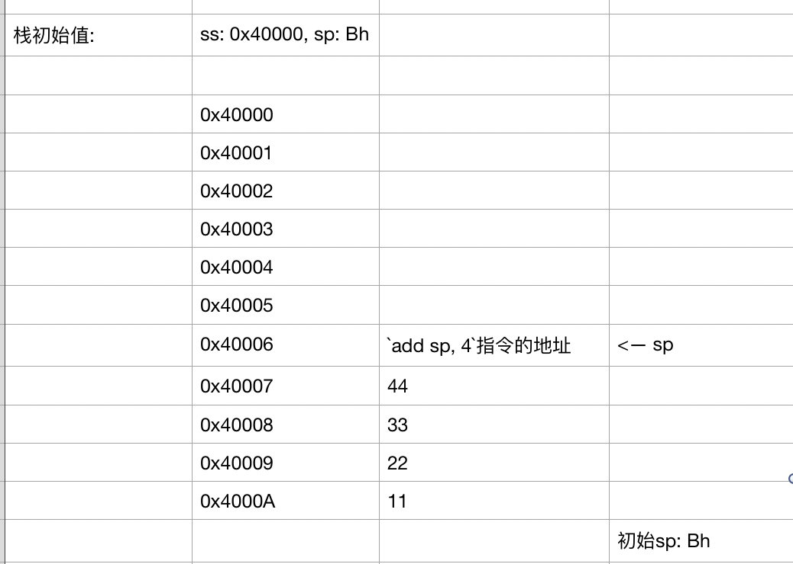
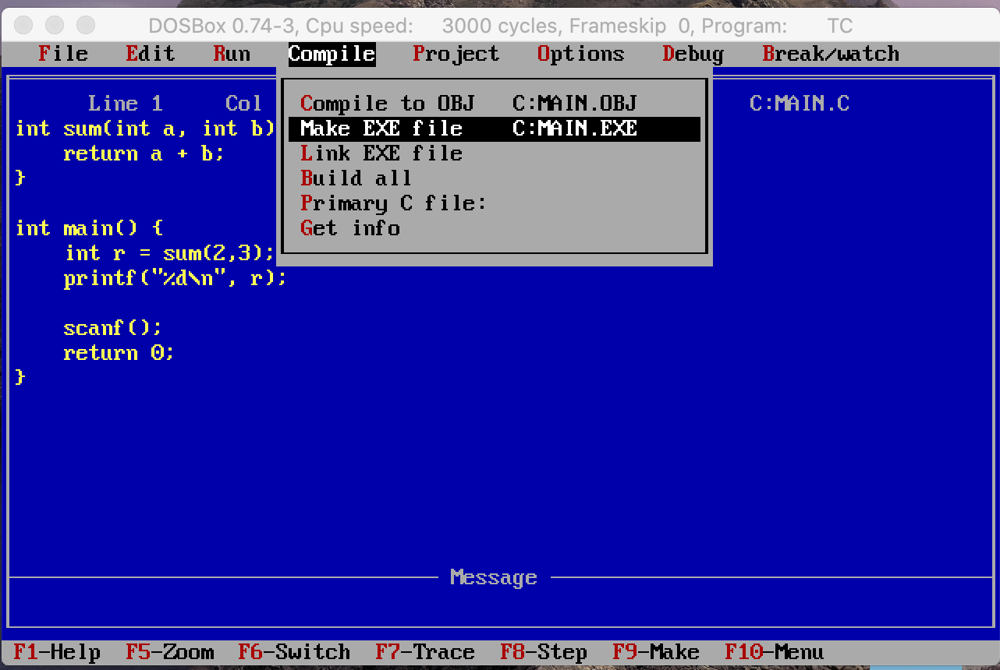

# 汇编13-call,ret指令和栈平衡

## 简单使用

> call->调用, ret->return

```
assume cs:code, ds:data, ss:stack
;栈段
stack segment
    db 10 dup(0)
stack ends
;数据段
data segment
    db 10 dup(0)
    string db 'hello$'
data ends
;代码段
code segment
start: 
    ;手动设置ds,ss的值
    mov ax, stack
    mov ss, ax
    mov ax, data
    mov ds, ax

    ;业务逻辑
    call print

    mov ax, 1122h
    
    ;退出
    mov ax, 4c00h
    int 21h

print:

    ;打印字符串hello, ds:dx告知字符串地址, ah=9打印功能
    mov dx, offset string
    mov ah, 9h
    int 21h
    ret  ; return->返回并执行下一个指令`mov ax,1122h`

code ends

end start
```

## 原理

> call 标号：

- 将下一条指令的偏移地址入栈后
- 转到标号处执行指令

> ret：将栈顶的值出栈，赋值给ip

可以使用汇编工具,单步执行,`查看cs:ip中ip的值`和`栈空间`的值, 在call和ret执行之后的变化

对函数调用会有更深层次的认识

```
void testA(){
    print("A");
}

void testB(){
    print("B");
}

int main() {
    
    testA();
    testB();
    return 0;
}

调用testA函数(call testA),会将testB函数的地址放入到栈中, 
当testA执行完之后, 出栈将testB的函数地址给ip,cs:ip执行`testB`方法
```

## 函数有返回值

函数来计算2^2

方式一: 错误❎
在函数内将计算结果放到栈中,行不通,因为call函数的时候, 函数之后的下一条指令的地址放到了栈中,`push result`的时候, 栈顶变化了, 函数返回就会返回到错误的地址

方式二: 不推荐
使用数据段来存放结果(相当于将结果放到了全局区),如下: 
(计算结果从寄存器ax放到内存中,再从内存中在放入到寄存器bx中,不推荐)

```
;数据段
data segment
    db 10 dup(0)
data ends

code segment
    ...
    call mathFunc
    mov bx, [0] ;bx为计算结果
    
;将计算结果放到数据段中
mathFunc:
    mov ax, 2
    add ax, ax
    mov [0], ax
    ret

code ends
```

方式三: 推荐✅
返回值放入ax通用寄存器中
基本上所有平台(mac,win,ios,linux),函数的返回值默认都会放到ax通用寄存器中(这是最快的方法)

```
code segment
    ...
    call mathFunc
    mov bx, ax ;ax为计算结果mathFunc的返回值
    
mathFunc:
    mov ax, 2
    add ax, ax
    ret

code ends
```

使用Xcode写个C函数来测试一下:

```
int mathFunc() {
    return 8;
}

int main() {
    int result = mathFunc();
    printf("%d", result);
    return 0;
}
```

打断点进行汇编调试:


## 函数有参数和返回值

参数传递需要遵守一个决定就可以, 比如下面的几种方式
比如两个数的和

方式一: 约定参数放到某几个固定的寄存器(运算速度快) ✅
> 因为8086CPU寄存器个数有限,所以8086CPU不使用这种方式, 但是x86_64, arm64等CPU因为寄存器的个数非常多了, 所以高级CPU都使用该方式, 比如使用Xcode进行汇编查看, 参数使用寄存器来传递的 [函数调用约定](https://www.jianshu.com/p/a3211eb250e1)

```
mov cx, 1122h
mov dx, 2233h
call sum

;返回值放到ax寄存器
;传递两个参数,约定分别放入cx,dx中
sum:
    mov ax, cx
    add ax, dx
    ret
```

方式二: 约定参数放到数据段,(全局区),不推荐

```
mov word ptr [0], 1122h
mov word ptr [2], 2233h
call sum

;返回值放到ax寄存器
;传递两个参数,约定分别放入`ds:0, ds:2`中
sum:
    mov ax, [0]
    add ax, [2]
    ret
```

方式三: 放到栈中(局部变量最适合放到栈中,用完出栈,变成垃圾数据)8086CPU推荐✅

> 栈平衡: 函数调用前后的栈顶指针一致

- 应该保证:函数调用前和函数调用后的栈应该是一样的(如果每次调用函数栈都会变化,那么多调用几次后,栈就会向上或向下溢出)
- 如果保持了栈平衡, 但是如果死循环(一直递归),也会导致栈溢出
 

汇编语法: 如果用ss来访问内容,不能用sp+2这种格式
`SP`和`BP`用于堆栈, SP用于指向栈顶, BP用来辅助栈来使用的, 应该用`ss:[bp+2]`这种格式来访问栈 ✨


```
;使用
push 1122h
push 3344h
call sum
add sp, 4  ;栈平衡

;返回值放到ax寄存器
;传递两个参数,约定分别放入栈中
sum:
    mov bp, sp
    mov ax, ss:[bp+2]
    add ax, ss:[bp+4]
    ret
```

因为`call sum`这个指令会将它下面的`add sp, 4`指令放入到栈中, 所以前三条指令执行完, 栈中的结构为: 


递归函数死循环的分析: 
函数里面调用函数,层级越深,栈中的数据越多,可能造成栈溢出
递归函数引起的栈溢出, 也是由于层级太深造成的

> 思考: 
> 函数分开调用 和 函数里面调用函数 的区别:

函数分开调用,每个函数调用完,都会讲sp指针回归到调用之前的位置,栈平衡


## 外平栈和内平栈

> 外平栈: 函数调用外面进行栈平衡 👇

```
push 1122h
push 3344h
call sum
add sp, 4  ;栈平衡

sum:
    mov bp, sp
    mov ax, ss:[bp+2]
    add ax, ss:[bp+4]
    ret
```

> 内平栈: 函数调用内部进行栈平衡 👇

```
push 1122h
push 3344h
call sum

sum:
    mov bp, sp
    mov ax, ss:[bp+2]
    add ax, ss:[bp+4]
    ret 4  ;栈平衡
```

使用`DOSBox`安装`turboc`,使用`turbox`来编写C语言程序并使用`DOSBox`进行编译生成可执行文件, 再放入`ida pro`中查看生成的汇编代码



main函数


sum函数:


## 函数的调用约定

> 一般用于c, c++, iOS中的调用是固定的,没办法控制
> `调用约定`可以控制函数的传参方式, 使用内平栈和外平栈的方式

todo:


