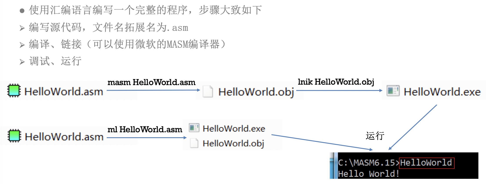
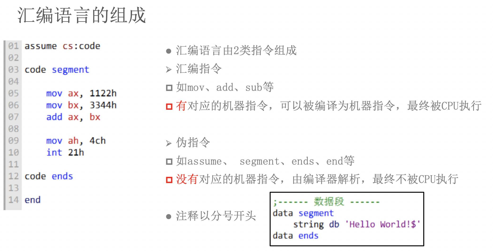
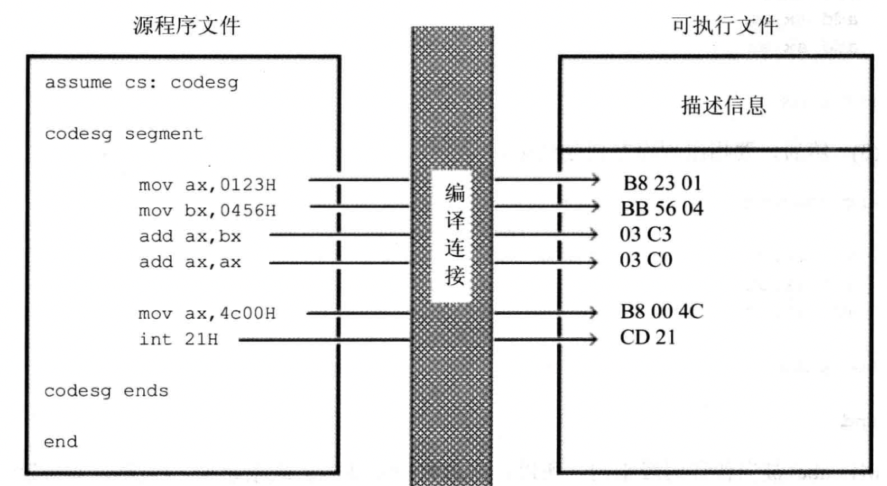
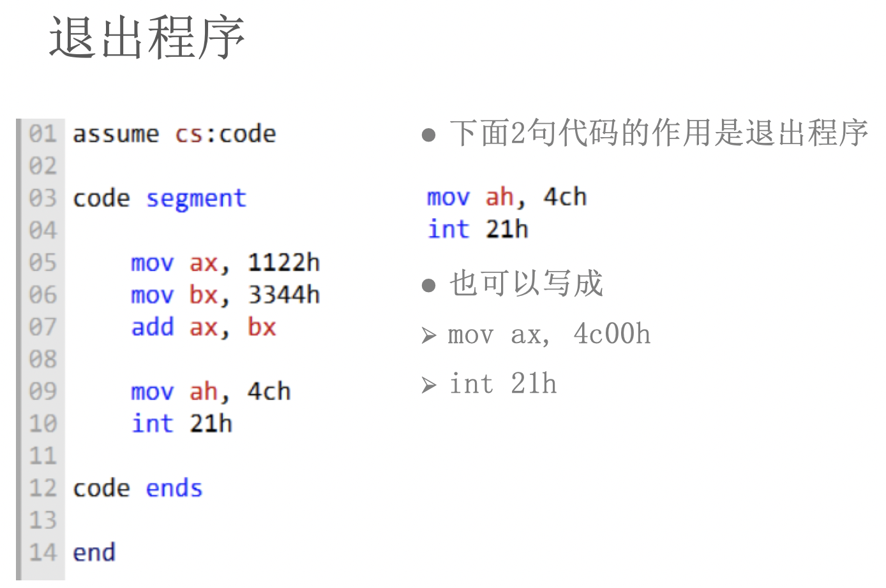

# 汇编-09-汇编程序组成



## 汇编语言组成

汇编语言的注释为: `分号;`

```assembly
mov ax, 1122h
mov bx, 3344h
add bh, al
add ah, bl

; ax = 5522h
; bx = 5544h

```




## 汇编程序的编写

```
assume cs:code

code segment
    mov ax, 1122h
    mov bx, 3344h
code ends

end
----------------------------
和下面一个意思:  `assume cs:`后面的单词可以任意指定 (假定CS代码段,用code单词表示)
----------------------------
assume cs:abc

abc segment
    mov ax, 1122h
    mov bx, 3344h
abc ends

end

```


ends = end segment

`end`除了通知编译器程序结束外, 还可以通知编译器程序的入口在什么地方 eg: `end start`, `end main`

## 标号

在汇编语言中,标号代表一个地址, 下面`code`代表一个段的地址, `s`标记了一个地址,这个地址处有一条指令:`add ax, ax`

```
code segment

code ends

s: add ax, ax
   loop s

```

## 汇编程序的正常退出

```
;只要给ah(ax的高字节)赋值为4c即可
mov ah, 4ch 
int 21h

所以下面都可以正常退出
; ax只要前面是4c就可以
mov ax, 4c01h
int 21h
; 同理
mov ax, 4c02h 
int 21h
; 同理
mov ax, 4c03h  
...
```

```
assume cs:code

code segment
    mov ax, 1122h
    mov bx, 3344h
    add ax, bx
    
    ;下面两句为正常退出程序, int表示中断
    mov ax, 4c00h
    int 21h
code ends

end
```




