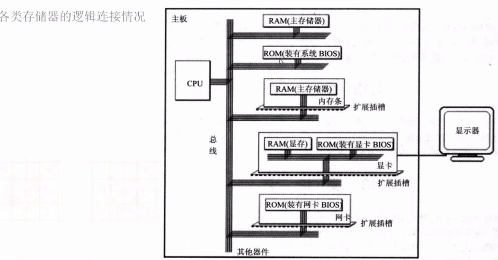
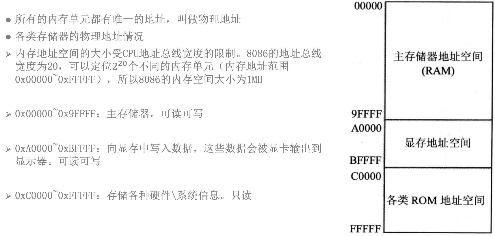
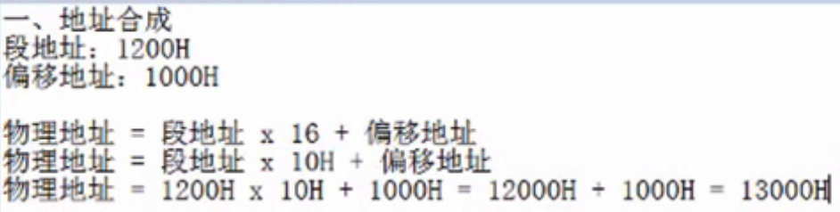
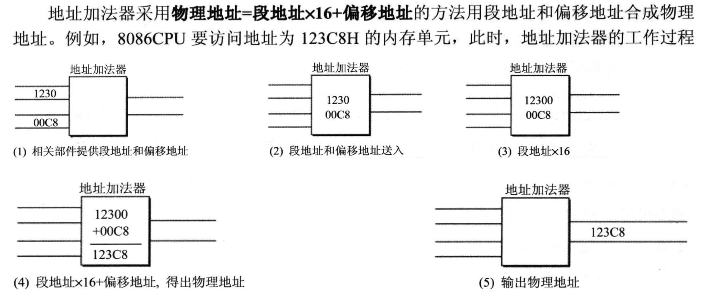
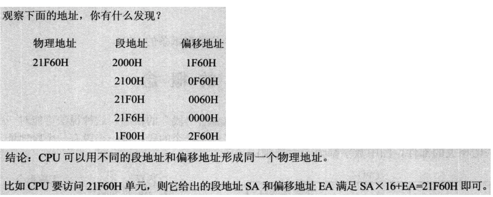
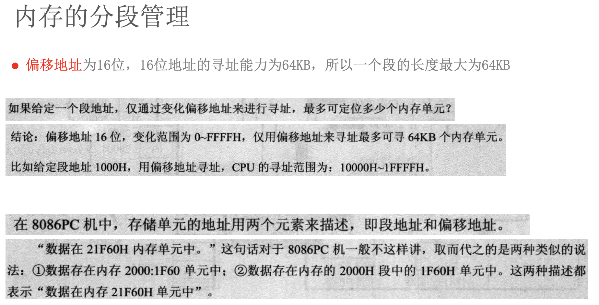

# # 汇编-02-内存和内存分段

todo: 
字节-位-kb等转换方式
各种进制在汇编中的表示方法
各种进制在代码中的表示方法

## 总线

地址线: 用来寻址
控制线: 告诉内存读还是写
数据线: 用来CPU和内存间传递具体数据(双向,根据读写的不同)

CPU从内存的3号单元读取数据步骤: 
CPU通过地址线将3传递给内存, 在将读的命令通过控制线传递给内存, 内存最终通过数据线将内存中的3号单位的内容读取出来给CPU

### 地址总线

- 内存的最小单元为字节
- 寻址能力, 比如内存为1M, 就需要地址总线宽度为20, (2的20次方), 内存为4G, 就需要更大的宽度
- 1个宽度相当于一个导线,  导线只能够传递电信号, 高电平代表1, 低电平代表0, 所以一个导线只能传递1或者0
- 2^10 = 1KB,  2^20 = 1M (最小为字节)

### 数据总线

- 数据总线宽度为16, 16个0或1, 即16位, 一个字节=8位, 所以单次最大传输为2个字节的数据

`89D8H`为16进制, `89D8`为2个字节大小, 向内存中写入89D8H

- 8088数据总线宽度为8, 则它一次性最多传输1个字节(8位)的数据, 所以它第一次传输D8, 第二次传输89
- 而8086CPU的总线宽度为16, 它一次就可以传输2个字节, `89D8`一次性传输就完成了

### 寻址 

- 一个CPU的寻址能力为8KB, 那么他的地址总线的宽度为 13
- 8080, 8088, 80286, 80386的地址总线宽度分别为16根, 20根, 24根, 32根, 则它们的寻址能力分别为: 64kb, 1MB, 16MB, 4GB (字节来算) -> 16根:16位的内存地址,即0xFFFF(一个16进制=4个二进制)
- 8080, 8088, 8086, 80286, 80386的数据总线的宽度分别为8根, 8根, 16根, 16根, 32根, 则他们一次可以传输的数据为1B, 1B, 2B, 2B, 4B(8根=8位=1个字节B)
- 比如CPU的地址总线的宽度为3, 那么它的传输的排列组合为(000,001,010,011,100,101,110,111), 可以看做内存地址编号(代表一个字节), 所以宽度为3的CPU,最大寻址能力为2^3=8个字节

RAM（random access memory）即随机存储内存，这种存储器在断电时将丢失其存储内容，故主要用于存储短时间使用的程序。ROM（Read-Only Memory）即只读内存，是一种只能读出事先所存数据的固态半导体存储器。

下图为8086CPU的内存图, 最下面的ROM地址空间为只读,向该内存空间中写数据是没有反应的

### 8086CPU特殊性

- 8086CPU最特殊, 后续的所有CPU的CPU位数=地址总线宽度, 没有特殊性
- 8086CPU是16位结构, 但是地址总线宽度为20位, 就是因为有16位要转成20位,所以只有8086CPU才有段地址和偏移地址的概念, 其他的CPU没有段地址和偏移地址的概念  
- 20为总线宽度, 所以寻址最大的内存为20位即0xFFFFF(20个二进制位), 但是CPU内部存储16位的地址, 所以8086CPU内部有个地址加法器, 产生20位的内存地址

