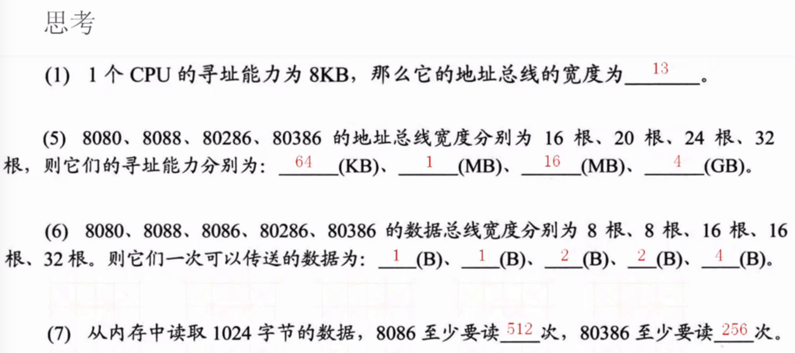
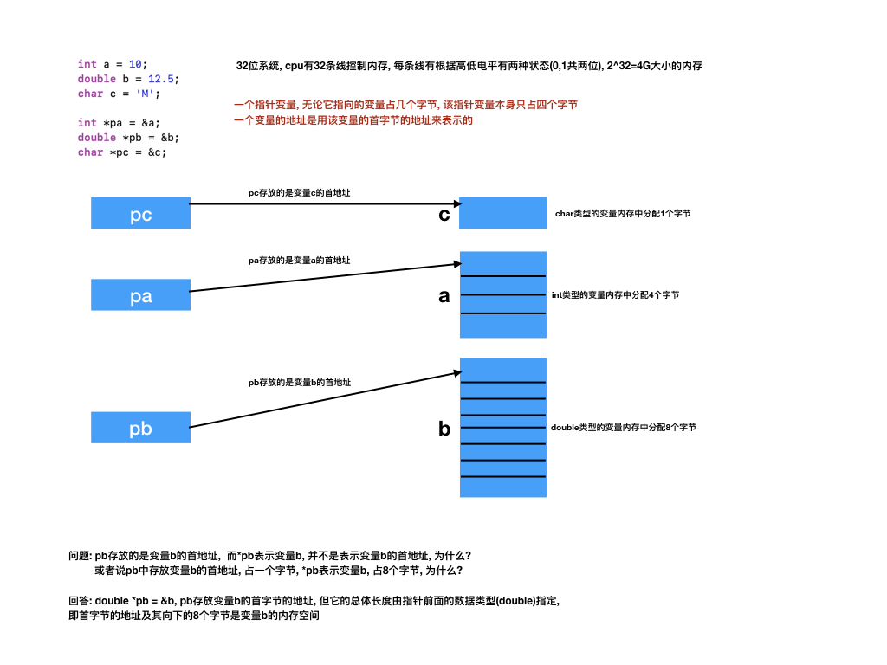
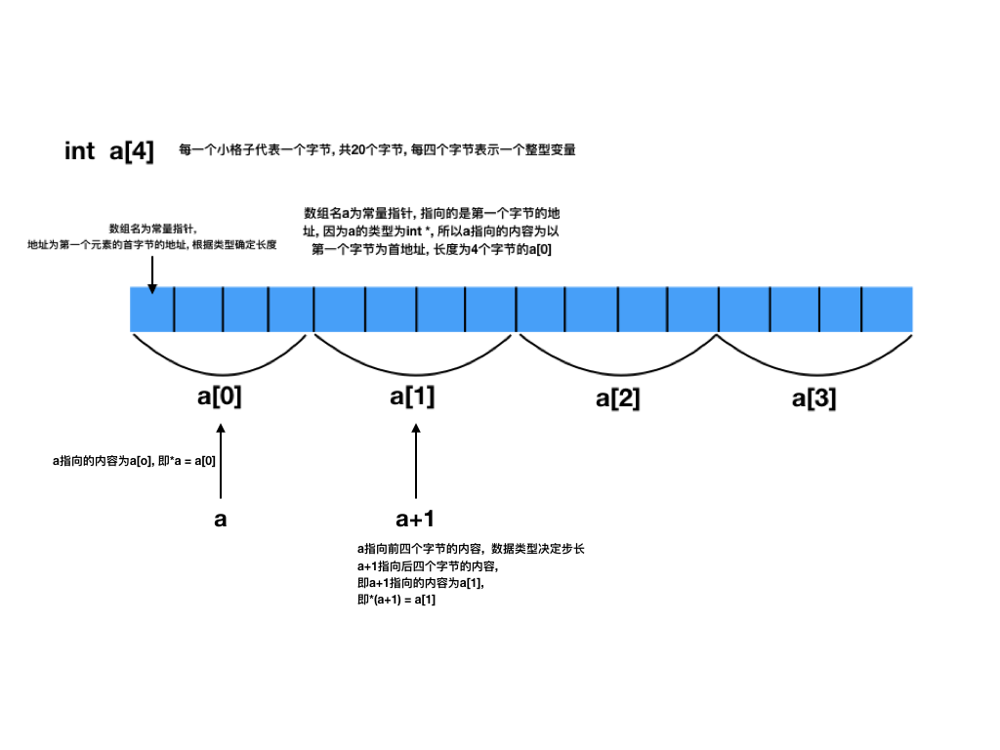
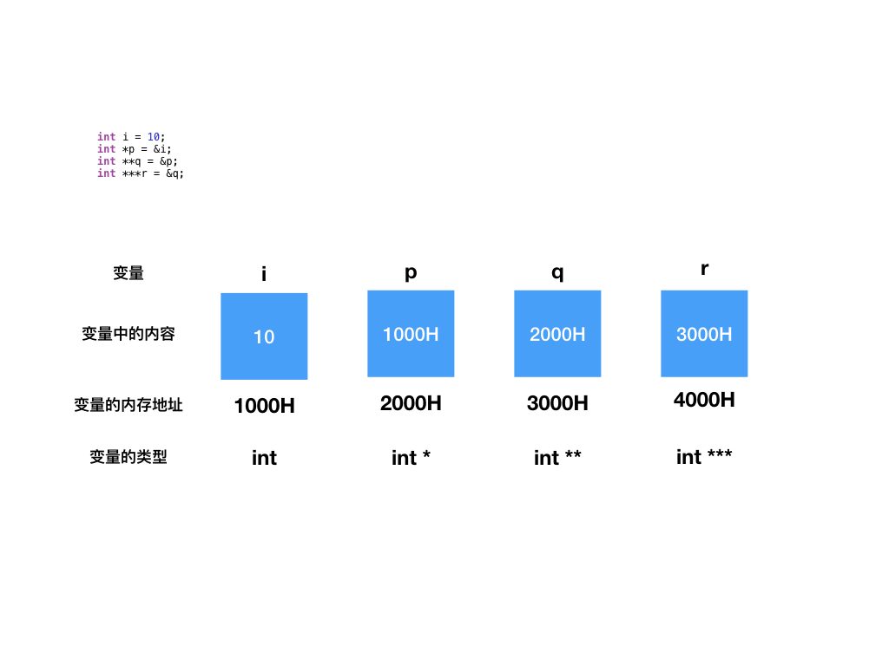

# 预备知识

## 进制

###进制的概念

N进制: 逢N进一
计算机只识别二进制
人类习惯使用十进制
为了实际需要 我们又建立了八进制和十六进制

C语言规定, 八进制前要加`0`(零), 十六进制前要加`0X`或者`0x`, 十进制前什么都不加

### N进制

十进制: 

* 逢十进一
* 0 1 2 3 4 5 6 7 8 9 10 11

二进制: 

* 逢二进一
* 0, 1, 10, 11, 100, 101, 110

八进制

* 逢八进一
* 0,1,2,3,4,5,6,7,10,11,12,13,14,15,16,17,20

十六进制: 

* 逢十六进一
* 0,1,2,3,4,5,6,7,8,9,A,B,C,D,E,F, 10,11,...,1F,20,...,FF


### 不同进制数的表示

在汇编中: 在数字后加字母`B`(Binary)表示二进制, 加字母`O`(Octal)表示八进制数, 加字母`D`(Decimal)表示十进制数, 加字母`H`(hex)表示十六进制数

例如: 

* `1011B`为二进制数1011, 也记为(1011)<sub>2</sub>
* `1357O`为八进制数1357, 也记为(1357)<sub>8</sub>
* `2049DD`为十进制数2049, 也记为(2049)<sub>10</sub>
* `3FB9H`为十六进制数3FB9, 也记为(3FB9)<sub>16</sub>

### 进制转换

用二进制表示0-15: 0000 ~ 1111
用十六进制表示0-15: 0  ~   F
一个十六进制可以用4个二进 制位替换, 反之亦然 `A = 1010`

记住二进制和十六进制的对应关系
0000 0001 0010 0011 0100 0101 0110 0111 1000 1001 1010 1011 1100 1101 1110 1111
  0    1    2    3   4     5   6    7     8    9    A    B   C     D    E   F


## 常量的存储

* 整数是以补码的形式转换成二进制码存储在计算机中
* 实数(小数)是以`IEEE754`标准转化为二进制码存储在计算机中
* 字符的本质也是与整数的存储方式相同 (字符->ASCII码->补码)

## 字节

一个二进制位是一`位`
一个字节等于8`位`
字节是存储数据的单位, 是硬件所能访问的最小单元
硬件cpu通过地址总线控制内存的最小单位是`字节`, 即内存中的一个内存单元编号为一个字节, 即8位一个内存编号
软件可以通过`位运算`控制最小单元`位`

- CPU为32位CPU, 它的最大寻址能力为 2^32的字节(不是位) = 4GB
- 比如CPU的地址总线的宽度为3, 那么它的传输的排列组合为(000,001,010,011,100,101,110,111), 可以看做内存地址编号(代表一个字节), 所以宽度为3的CPU,最大寻址能力为2^3=8个字节



第5题: (16根,对应内存地址编号即字节,2^16次方个字节)
第6题: (8根=8位=1个字节B)


## 单位


## ASCII码

[ASCII码对照表](http://ascii.911cha.com)

> 因为计算机内部终究是高低电平, 用1,0来代表高低电平得到了二进制, 而例如`abcdef@#,!%`等字符不是数字, 所以就引入了一套标准来同一规定, 使计算机建立起符号和数字之间的联系

ASCII码不是一个值, 是一种规定
ASCII码规定了不同的字符是使用不同的整数值表示
例如: A->65, B->66, a->97

> 所以字符的存储本质上与整数的存储相同

## 指针

* 指针就是地址, 地址就是指针, 地址就是内存单元的编号
* 指针变量就是存放内存单元编号的变量,或者说指针变量就是存放地址的变量
* 内存中以一个字节为一个内存单元



### sizeof

* `sizeof(数据类型)`返回值就是该数据类型所占的字节数,例如: `sizeof(double)`返回值为8, `sizeof(int *)`返回值为8
* `sizeof(变量名)`返回值为该变量所占的字节数

```C
char c = 'A';
double d = 12.14;
char *pc = &c;
double *pd = &d;
printf("%ld, %ld, %ld\n", sizeof(pc), sizeof(pd), sizeof(*pc)); 
//打印8, 8, 1

printf("sizeof(int *) = %ld\n", sizeof(int *)); //8 指针占8个字节
printf("sizeof(char *) = %ld\n", sizeof(char *)); //8 指针占8个字节
```

###指针和基本数据类型

```C
int *p; //p是指针变量的名字, p的数据类型为`int *`, `int *`类型表示的是存放int变量地址的类型
int i = 3;
p = &i; //指针变量p保存了普通变量i的地址, 因此指针变量p指向i, *p表示变量p指向的变量i
//*p 取地址的逆运算,即将地址中的内容取出来
```

###指针和一维数组

数组占用的空间是连续的
数组名是个指针常量, 它存放的是数组第一个元素的地址

```C
int a[5] = {1,2,3,4,5};
printf("%#x\n", a); //0xefbff550
printf("%#x\n", &a[0]);//0xefbff550

int a[5]; //指针常量a, a的类型是`int *`, a存放的是数组第一个元素的地址
int b[5];
a = b; //error, 数组名为指针常量, 不能赋值
```

确定一个数组需要两个参数, 数组的首地址和数组元素的个数
不同于字符串, 字符串只需要首地址就可以, 因为字符串有个`\0`结束标记

```C
void foo(int *pArr, int length) {
    for (int i = 0; i < length; i++) {
        printf("%d \n", *(pArr+i)); //等价于 pArr[i]
    }
}

int main(int argc, const char * argv[]) {
    //1. a指针常量, 类型是int *, 存放的是数组第一个元素的地址
    int a[5] = {1,2,3,4,5};
    foo(a, 5);
}
```

指针变量不能相加, 不能相乘, 不能相除
如果两个指针变量指向的是同一块连续空间中的不同存储单元
则这两个指针可以相减

```C
int a[5] = {1,2,3,4,5};
int *p = &a[1];
int *q = &a[4];
printf("p和q所指向的单元相隔%ld个单元", q-p);
//p和q所指向的单元相隔3个单元
```




### 多级指针



```C
int i = 10;
int *p = &i;
int **q = &p;
int ***r = &q;
/**
 p存放的是i的地址, 所以p的类型为: 在i的类型后面加上*号, 即 int *;
 q存放的是p的地址, 所以q的类型为: 在p的类型后面加上*号, 即 int **;
 r存放的是q的地址, 所以r的类型为: 在q的类型后面加上*号, 即 int ***;
 r = &p;//错误: 因为r是int ***类型, r中只能存放int **类型的变量的地址

 *p = i;
 * *q = i;
 * * *r = i;
 */
```

```
//该函数栈中存在两个局部变量q, i;
//q存放的是指针变量p的地址
void foo(int **q) {
    int i = 3;
    *q = &i;
}

int main() {
    int *p;
    foo(&p);
    printf("%d\n", *p); 
    //虽然打印3, 语法没问题, 但是逻辑上foo函数执行完, 局部变量i的所在的地址被回收了
    //如果foo函数中的*q = &i; 改成*q = (int *)malloc(sizeof(int));是可以的, 因为动态创建的在堆区, 并且没有free进行释放
    return 0;
}
```

## 动态分配 malloc

### 动态分配变量

> malloc: 是`memory(内存)`和`allocate(分配)`的缩写

```C++
int a = 5;//系统分配4个字节, 静态分配
    
/*
 *malloc(size_t __size)
 参数size为系统分配的字节数
 返回值为: 返回第一个字节的地址
 */
int *p = (int *)malloc(4); //p变量占四个字节(指针变量)->系统静态分配, p指向的内存也占4个字节->动态分配
free(p); //表示把p指向的内存释放掉, p变量本身的内存是静态的, 由系统自动释放
    
//*p和上面的a都是int类型的变量, 但是他们的分配方式不同
    
double *q = (double *)malloc(sizeof(double) * 5); //分配5个double类型的空间
```

### 动态分配一维数组

```C
int length;
printf("请输入要存放的元素的个数!\n");
scanf("%d", &length);
int *pArr = (int *)malloc(sizeof(int) * length);
//int pArr[length]

realloc(pArr, 100);//扩容或缩小容量 将pArr所指向的内存变成100, 可以保留原来的内容

free(pArr);//释放掉动态分配的数组
```

## 结构体变量

> 把一些基本类型数据组合在一起形成一个新的复合数据类型, 结构体

###定义结构体的方式

```C
struct Student {
    int age;
    float score;
    char sex;
};

struct Student {
    int age;
    float score;
    char sex;
};

```


